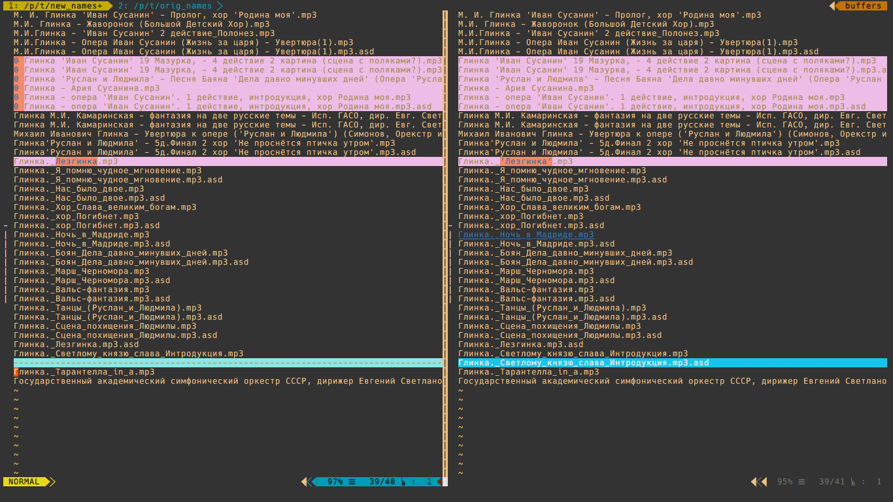

# Bulk file renaming in Vim
__%% w/changes by charmsword__
Bulk renaming files can be annoying and time consuming.
This simple tool allows you to use Vim's powerful editing commands to make this task easier.

__Be warned:__ filenames with doublequotes (") will scrumble script, particulary the `mv` command;

so you have two ways: __1)__ change all doublequotes inside vim to something you prefer, or __2)__ use script with argument: `vrf -c`, it will automatically replace all doublequotes with singlequotes 

## Requirements

Any POSIX operating system with Vim and Bash should work.

__%% MacOsX as well for this version (Yosemite 10.10.4, 10.10.5 tested)__

## Installation

Simply put the file `vrf` somewhere in your path and make sure it is executable.

## Usage

Usage: vrf [FOLDER]

When FOLDER is not given the current directory is used.

Open a list of filenames from FOLDER in Vim for mass renaming.
__Diff added to enable highlighting for all changes you make in realtime__:

Upon exiting Vim the files will be renamed as needed.
Files can also be removed by replacing the filename with and empty line.
Exit Vim without saving or save an empty file to cancel.

__WARNING: DO NOT reorder the filenames or remove lines,__ as the algorithm depends
on the line number to identify the original file. To aid the user the 'dd'
command is remapped to clear the current line, which results in the file being
deleted.

## Collaboration

%% This is a fork of original vr script by Hans Maree (snah) by me (charmsword)
%% Feel free to fork and modify further!
